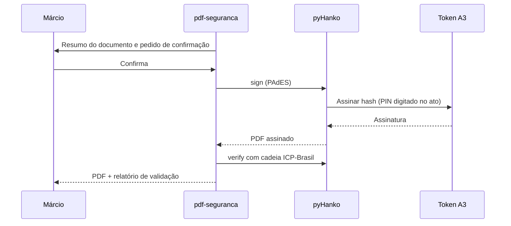

# papiro-assinatura-icp

## Fluxo e requisitos (PRD §12 e §12.1)

A verificação de rotina é local; nenhum documento de paciente é enviado a validador on-line.

| Aspecto | Especificação |
| --- | --- |
| Certificados | A1 em arquivo PFX e A3 em token ou cartão via PKCS#11. O certificado é pré-requisito do usuário, não uma ferramenta do PAPIRO |
| Perfil padrão | PAdES-B-B; B-T quando houver TSA configurada; B-LTA para arquivo de longo prazo |
| Carimbo do tempo | TSA RFC 3161 configurável. Carimbo de ACT credenciada na ICP-Brasil pode ter custo e fica opcional |
| Âncoras de confiança | Cadeia das ACs ICP-Brasil carregada no validador local |
| Aparência visível | Nome, CRM, data e hora, QR de validação; nunca sobre o conteúdo |
| Certificação | DocMDP que permite só preenchimento e novas assinaturas |
| Política de assinatura | Suporte a atributos CAdES de política; spike técnico confirma se o validador do ITI exige política explícita |
| Fallback para A3 | JSignPdf usando o repositório de certificados do Windows |
| Homologação | A cada troca de certificado ou versão do pyHanko, um documento de teste sem dados de paciente é conferido nos validadores do ITI e do CFM |
| Proibições | Assinar sem confirmação; gravar PIN ou senha; assinar documento reprovado nos portões |

## Ferramenta real (servidor papiro-seguranca, só no subagente pdf-seguranca)
**A1 (arquivo PFX):** `sign entrada=... out_dir=... pfx=<arquivo .pfx> senha_ref="env:NOME" | "keyring:servico/usuario"
 confirm=true visivel=true caixa="x0,y0,x1,y1" crm="00000-UF"` → PAdES-B-B, SHA-256, verificação local logo após assinar.

**A3 (token ou cartão, via PKCS#11):** `sign entrada=... out_dir=... token="<rótulo do token>" modulo="<biblioteca PKCS#11>"
 pin_ref="env:NOME" | "keyring:servico/usuario" | "prompt" confirm=true` (mesmas opções de aparência).
- Descubra o que existe no token antes: `papiro token` lista tokens conectados e os certificados de cada um
  (rótulo, id, titular, validade). Com um único token conectado, `token=` é dispensável; com vários, é obrigatório.
- `modulo` sai do driver do fabricante (SafeNet `eTPKCS11.dll`, Watchdata `WDPKCS.dll`, OpenSC `opensc-pkcs11.so`).
  Pode ficar fixo em `papiro.toml [assinatura] pkcs11_modulo`. Se o token tiver mais de um certificado, escolha
  com `rotulo=` ou `id_chave=` — a mensagem de erro lista os disponíveis.
- **O PIN nunca é argumento nem fica gravado:** vem de variável de ambiente, do chaveiro, ou é digitado no ato
  (`pin_ref="prompt"`, só em terminal). Nunca peça o PIN no chat. PIN errado gasta tentativa — o token bloqueia.
- A chave privada nunca sai do token: o PAPIRO manda o hash e recebe a assinatura.

**Carimbo do tempo RFC 3161 (PAdES-B-T):** `sign ... carimbo=true` (ou `tsa="https://..."`) acrescenta o carimbo
à assinatura. `timestamp entrada=... tsa=...` carimba o documento inteiro sem assinar (DocTimeStamp) e pode ser
aplicado depois, sobre um PDF já assinado, sem quebrar a assinatura.
- A TSA sai de `tsa=` ou de `[assinatura] tsa_url` no `papiro.toml` (com `tsa_usuario`/`tsa_senha_ref` se ela exigir
  autenticação). Carimbo de ACT credenciada na ICP-Brasil costuma ser pago — por isso é opcional.
- **Só o resumo SHA-256 do documento vai para a TSA**; o conteúdo nunca sai da máquina. Ainda assim é rede: em job
  sensível a chamada é recusada (E_POLITICA) até vir `rede_tsa=true` explícito (§12.5). O envelope traz um aviso
  dizendo exatamente o que foi enviado e para qual servidor.
- O envelope mostra `dados.carimbo` com a hora atestada, a autoridade e se o carimbo está íntegro; `verify` também
  passa a listar o carimbo de cada assinatura e os carimbos de documento.

Valem para A1 e A3:
- A senha/PIN NUNCA vai como argumento: só referência a variável de ambiente ou chaveiro.
- Documento reprovado nos portões não é assinado (E_POLITICA). Aparência sobre conteúdo é recusada.
- `certify` = DocMDP (permite só preenchimento e novas assinaturas). Aceita A1, A3 e carimbo.
- Sem suporte ainda: LTV B-LT/B-LTA (`ltv_update`) e JSignPdf.
- Homologação: a cada troca de certificado, conferir um documento de teste sem dados de paciente no validar.iti.gov.br.

Fonte canônica: `docs/PAPIRO_PRD_ORIGINAL.md` (trechos acima copiados verbatim) e `docs/AGENTE_AUTONOMO_ENGENHARIA_PDF.md`. Ferramentas do MCP `papiro` respondem no envelope §8.1 (`ok`, `job_id`, `outputs`, `engine`, `qa`, `error`). Nunca declarar sucesso com `ok=false`.
