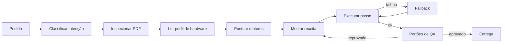

# papiro-roteamento

## Como rotear
1. Classifique e veja os motores pontuados: ferramenta `jobs` com `op=route` e `pedido=<texto do usuário>`
   (tarefa + motores com `pontuacao = qualidade × compatibilidade × taxa histórica − custo`).
2. Inspecione antes de agir: `inspect op=all`.
3. Execute com a ferramenta do nível; se `error.code=E_MOTOR` tente o fallback; `E_SEM_SUPORTE` = proponha alternativa.
4. Entrega só com `qa.status=APROVADO` (no máximo 3 ciclos de correção; depois mostre ao usuário).

## Tabela de decisão (PRD §9.2)
| Situação | Motor escolhido | Motivo | Fallback |
| --- | --- | --- | --- |
| Documento novo com tipografia de alto nível | Typst | Controle tipográfico fino, compilação rápida, PDF/UA-1 nativo | LuaLaTeX |
| Layout em HTML/CSS ou com JavaScript | Chromium | Suporte completo a CSS moderno | WeasyPrint |
| Exigência de PDF/UA-2 | LuaLaTeX | O Typst ainda gera só UA-1 ([Typst](https://typst.app/docs/reference/pdf/)) | Reconstrução + veraPDF |
| PDF/A a partir de PDF existente | Ghostscript + veraPDF | Converte cor e fontes | OCRmyPDF com saída PDF/A |
| Escaneado simples, perfil P0 | OCRmyPDF + Tesseract | Rápido e estável em CPU | RapidOCR |
| Escaneado com tabelas e fórmulas | PaddleOCR-VL 1.6 (P1, P2 ou P3); Docling (P0) | Maior precisão estrutural | MinerU2.5-Pro |
| PDF digital para Markdown | PyMuPDF4LLM | Dispensa OCR | Docling |
| Arquivo para gráfica | Ghostscript | PDF/X-1a, X-3 e X-4 nativos | Scribus |
| Office para PDF | LibreOffice | Fidelidade com DOCX, XLSX e PPTX | — |
| Assinatura com token A3 | pyHanko via PKCS#11 | PAdES completo | JSignPdf via repositório do Windows |
| Comparar versões | difflib + diff-pdf | Cobre texto e aparência | PyMuPDF + SSIM |
| Tradução | PDFMathTranslate + Ollama | Preserva layout, roda local | Argos Translate + recomposição |

## Algoritmo (PRD §9.1)

A reprovação no QA volta ao plano, com no máximo 3 ciclos antes de pedir ajuda ao usuário.

Pontuação de cada motor: `qualidade esperada × compatibilidade com o hardware × taxa histórica de sucesso − custo de tempo`. A taxa histórica vem do SQLite, por tipo de tarefa, e melhora a escolha com o uso.

## Estado real neste ambiente
Disponíveis: Typst, PyMuPDF (Story), Chromium, LibreOffice, Ghostscript+veraPDF, OCRmyPDF+Tesseract, PyMuPDF4LLM,
pdfplumber, pyHanko (A1), Presidio+spaCy pt, OpenCV. Ausentes (a ferramenta devolve E_SEM_SUPORTE): LuaLaTeX, WeasyPrint,
Docling, PaddleOCR-VL, MinerU, PDFMathTranslate, Touying, pdfimpose, JSignPdf, A3/PKCS#11.

Fonte canônica: `docs/PAPIRO_PRD_ORIGINAL.md` (trechos acima copiados verbatim) e `docs/AGENTE_AUTONOMO_ENGENHARIA_PDF.md`. Ferramentas do MCP `papiro` respondem no envelope §8.1 (`ok`, `job_id`, `outputs`, `engine`, `qa`, `error`). Nunca declarar sucesso com `ok=false`.
