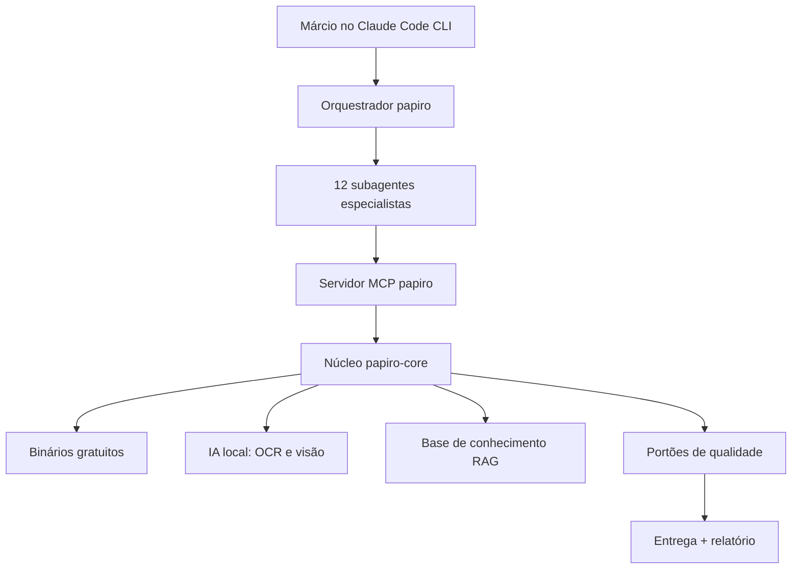
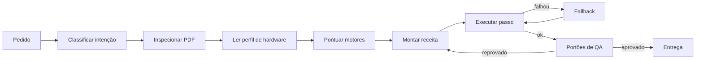
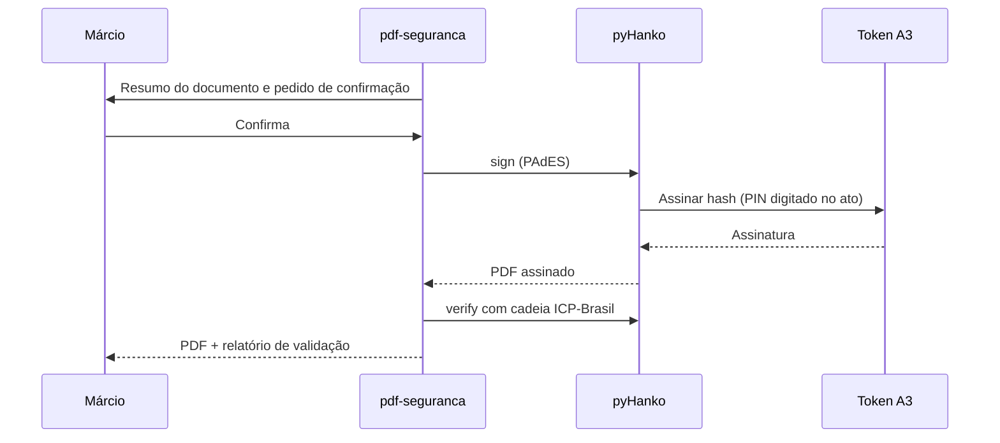

# PAPIRO — PRD do Agente Soberano de PDF (Windows 10 · CLI)

2026-09-16 · @u_vCXIHS54HXV71ZJsDPxqGg

## 1. Sumário executivo

PAPIRO é um agente de CLI para Windows 10 que cria, edita, diagrama, converte, valida, assina e analisa PDFs de ponta a ponta, usando apenas ferramentas gratuitas e executadas localmente.

O host primário é o Claude Code CLI. O núcleo, porém, é um motor Python próprio exposto por um servidor MCP, então funciona em qualquer CLI compatível com MCP. Esse núcleo orquestra dezenas de motores especializados e escolhe o melhor para cada tarefa.

O que o torna estado da arte, e não um agente comum:

- **Roteamento por especialidade:** Typst para tipografia, Chromium para HTML/CSS moderno, Ghostscript para produção gráfica, modelos de visão para documentos escaneados. Nenhum motor único faz tudo bem.
- **Loop de QA visual:** cada página é renderizada, inspecionada por visão e por heurísticas, corrigida e só então entregue.
- **Conformidade com prova:** PDF/A, PDF/UA e PDF/X só são declarados depois de passar em validador independente.
- **Assinatura e privacidade:** assinatura PAdES com certificado ICP-Brasil (A1 e A3) e tarjamento real de dados pessoais para LGPD.
- **Reprodutibilidade:** tarefas viram receitas YAML versionadas, com trilha de auditoria e hash SHA-256 de entrada e saída.
- **Soberania:** zero custo de licença, zero envio obrigatório de documentos para nuvem; IA local opcional conforme o hardware.

Resultado esperado: qualquer pedido em linguagem natural, de "junte estes dois PDFs" a "monte o catálogo em CMYK com sangria para a gráfica", é executado e entregue com um relatório de qualidade anexado.

## 2. Visão, princípios e escopo

A visão é um único agente que resolve todas as tarefas de PDF de um profissional solo, com acabamento de estúdio gráfico e prova técnica de cada entrega.

### 2.1 Princípios de produto

1. **Prova antes de promessa.** Nenhum PDF sai sem relatório de qualidade. Conformidade só é declarada após validador independente.
2. **Original intocável.** Toda operação grava um arquivo novo. A entrada nunca é sobrescrita.
3. **Motor certo para cada trabalho.** Roteamento por capacidade, com fallback automático quando um motor falha.
4. **Local e gratuito por padrão.** Nenhuma dependência paga. Nuvem só com pedido explícito do usuário.
5. **Determinismo onde importa.** Hooks bloqueiam ações perigosas; receitas geram o mesmo resultado a partir da mesma entrada.
6. **Visão no loop.** O agente olha as páginas renderizadas como um diagramador experiente olharia.
7. **Uma pergunta por vez.** Faltando dado essencial, pergunta só o necessário e segue.

### 2.2 Dentro do escopo

| Domínio | O que cobre |
| --- | --- |
| Inspeção e forense | Metadados, fontes, imagens, revisões incrementais, estrutura de objetos |
| Operações de página | Juntar, dividir, extrair, girar, recortar, reordenar, n-up, livreto |
| Edição | Texto, imagens, marca d'água, carimbos, numeração Bates, anotações, camadas (OCG) |
| Criação | Markdown, HTML/CSS, Office, dados JSON/CSV/XLSX, mala direta em lote |
| Design gráfico | Brand kit, grid, escala tipográfica, cor, gráficos, diagramas, capas, infográficos |
| Produção gráfica | CMYK com perfil ICC, sangria, marcas de corte, imposição, cobertura de tinta, PDF/X |
| Apresentações | Slides em PDF, handouts, notas do apresentador, transições, modo quiosque |
| Inteligência documental | OCR, análise de layout, tabelas, fórmulas, RAG com citação de página, tradução com layout, comparação |
| Formulários | Criar, detectar campos em PDF plano, preencher em lote, exportar dados, achatar |
| Conformidade | PDF/A, PDF/UA, PDF/X, acessibilidade, validação e remediação |
| Segurança | AES-256, permissões, assinatura PAdES com ICP-Brasil, carimbo do tempo, tarjamento LGPD, sanitização |
| Conversão | PDF para e de DOCX, XLSX, PPTX, HTML, Markdown, EPUB, PNG, SVG e DXF |
| Reparo | Tabela xref quebrada, streams corrompidos, fontes ausentes, PDFs truncados |
| Automação | Lotes, pastas monitoradas, filas, relatórios consolidados |

### 2.3 Fora do escopo

- Quebra de senha ou remoção de proteção sem a senha legítima.
- Falsificação de documentos, assinaturas, carimbos ou datas.
- Qualquer dependência paga, trial ou SaaS com cota como requisito obrigatório.
- Interface gráfica própria: o PAPIRO é CLI e usa visualizadores externos para conferência humana.

### 2.4 Premissas

- Host primário: Claude Code CLI no Windows 10 64 bits. Host alternativo: OpenCode, via o mesmo servidor MCP.
- Usuário único, máquina local, idioma principal pt-BR com suporte multilíngue.
- Máquina Kubuntu com GPU AMD de 16 GB na rede local, opcional, para modelos de visão pesados.
- Documentos médicos e pessoais são processados apenas localmente.

## 3. Ambiente-alvo e perfis de hardware

O PAPIRO roda no Windows 10 22H2 de 64 bits, dentro do Claude Code CLI, e se ajusta sozinho a quatro perfis de hardware detectados na instalação.

### 3.1 Sistema operacional e terminal

- **Windows 10 22H2.** O suporte padrão acabou em 14/10/2025. O ESU de consumidor entrega atualizações críticas até 12/10/2027, segundo a [página oficial da Microsoft](https://www.microsoft.com/en-us/windows/extended-security-updates). Requisito do PRD: máquina inscrita no ESU.
- **Terminal:** Windows Terminal com PowerShell 7. No Windows, os hooks do Claude Code são scripts PowerShell declarados com `shell: powershell` ([documentação de subagentes](https://code.claude.com/docs/en/sub-agents)).
- **Gerenciadores:** winget (nativo), Scoop (portátil, sem admin), uv (Python) e npm (Node LTS).
- **WSL2:** opcional, apenas para ferramentas que só existem em Linux.
- **Recursos mínimos recomendados (estimativa):** 16 GB de RAM (32 GB ideal) e 40 GB livres em SSD para binários, fontes e modelos.

### 3.2 Restrições do Windows tratadas pelo projeto

| Restrição | Tratamento obrigatório |
| --- | --- |
| Arquivo aberto em visualizador fica travado | Gravar em temporário e trocar com `os.replace`; detectar trava e avisar |
| Caminhos com acento e espaço | `PYTHONUTF8=1`, `pathlib` em tudo, testes com nomes como `Relatório — Márcio.pdf` |
| Limite de 260 caracteres no caminho | Ativar `LongPathsEnabled` e usar raiz curta `C:\PAPIRO` |
| Criar processos é caro | Workers persistentes: LibreOffice via unoserver, Chromium via Playwright, pool Python |
| Defender varre cada arquivo do lote | Exclusão opcional só da pasta temporária, com aviso de risco |
| Binários com nomes próprios do Windows | Resolvedor central de binários (ex.: `gswin64c.exe`, `soffice.com`) |
| Fontes do sistema em duas pastas | Indexar `C:\Windows\Fonts` e `%LOCALAPPDATA%\Microsoft\Windows\Fonts` |

### 3.3 Perfis de hardware

| Perfil | Como é detectado | IA local disponível | Uso típico |
| --- | --- | --- | --- |
| P0 — Só CPU | Nenhuma GPU utilizável | OCR Tesseract e PaddleOCR em CPU; Docling em CPU | Tudo, exceto modelos de visão pesados |
| P1 — GPU NVIDIA local | `nvidia-smi` responde | Modelos de visão para OCR em CUDA | Parsing de alta precisão na própria máquina |
| P2 — GPU AMD local | Adaptador AMD via DirectML ou Vulkan | ONNX via DirectML; GGUF via Ollama, LM Studio ou llama.cpp Vulkan | Modelos de visão de porte médio |
| P3 — Nó remoto Linux | Endpoint HTTP configurado | Modelos pesados na máquina Kubuntu com GPU AMD 16 GB (ROCm), em API compatível com OpenAI | Lotes grandes de documentos escaneados |

O perfil ativo fica em `papiro.toml` e o roteador (seção 9) só oferece motores compatíveis com ele.

## 4. Arquitetura do sistema

São seis camadas: o host CLI fala com um orquestrador, que delega a subagentes especialistas; todos usam um único servidor MCP, que aciona o núcleo Python e os motores.



O fluxo desce do pedido até os motores e só volta ao usuário depois dos portões de qualidade.

### 4.1 Camadas

| Camada | Componente | Responsabilidade |
| --- | --- | --- |
| L1 — Host | Claude Code CLI (OpenCode como alternativo) | Conversa, permissões, hooks, leitura das páginas renderizadas |
| L2 — Orquestração | Agente `papiro`, iniciado com `claude --agent papiro` | Entender o pedido, planejar, delegar, consolidar a entrega |
| L3 — Especialistas | 12 subagentes em `.claude/agents/papiro/` | Execução por domínio, cada um com contexto isolado |
| L4 — Contrato | Servidor MCP `papiro` (FastMCP, transporte stdio) | Ferramentas tipadas, validação de entrada, erros padronizados |
| L5 — Núcleo | Pacote `papiro-core` (Python 3.12+) | Adaptadores de motores, roteador, executor de receitas, QA, auditoria |
| L6 — Motores | Binários, bibliotecas e modelos gratuitos | O trabalho pesado de PDF |

Componentes transversais: base de conhecimento local (RAG), memória persistente dos subagentes, biblioteca de brand kits e templates, trilha de auditoria.

### 4.2 Ciclo de vida de um job

1. **Intake:** o orquestrador classifica o pedido e cria `job-id`.
2. **Isolamento:** copia as entradas, como somente leitura, para `C:\PAPIRO\work\<job-id>\in`.
3. **Plano:** o roteador monta a receita de passos e mostra o plano quando a tarefa é destrutiva ou longa.
4. **Execução:** cada passo grava em pasta própria, com hash SHA-256 e métricas.
5. **QA:** os portões da seção 11 rodam; falha gera correção automática, até 3 ciclos.
6. **Entrega:** resultado em `C:\PAPIRO\out\<data>\<job-id>` com `qa-report.md`, `qa-report.json` e `audit.jsonl`.

### 4.3 Decisões de arquitetura

| ID | Decisão | Motivo |
| --- | --- | --- |
| ADR-01 | MCP como contrato único, mais uma CLI `papiro` (Typer) espelhando as mesmas funções | Portável entre hosts; scripts e lotes rodam sem LLM |
| ADR-02 | Python como núcleo | Maior ecossistema de PDF e IA documental |
| ADR-03 | Todo binário atrás de adaptador com timeout, captura de stderr e checagem de versão | Falhas previsíveis e trocáveis |
| ADR-04 | Estado dos jobs em SQLite | Retomada após queda, histórico e métricas sem servidor |
| ADR-05 | Descrições de subagentes curtas; detalhes no corpo do agente | O Claude Code alerta quando as descrições somadas passam de 15.000 tokens ([docs](https://code.claude.com/docs/en/sub-agents)) |
| ADR-06 | Componentes AGPL usados apenas localmente, sem distribuição | Uso pessoal não gera obrigação de abrir código; reavaliar se virar serviço para terceiros |
| ADR-07 | Modelo por subagente: tarefas de inspeção em modelo rápido, design e QA em modelo mais forte | Custo e latência menores sem perder qualidade |

## 5. Stack tecnológico gratuito

Todo o stack é gratuito; cada função tem um motor primário e um fallback, e as versões abaixo foram conferidas em 16/09/2026 e serão travadas em lockfile.

### 5.1 Núcleo de manipulação

| Função | Primário | Fallback | Licença |
| --- | --- | --- | --- |
| Leitura, renderização, edição, tarjamento, anotações | [PyMuPDF 1.28](https://pypi.org/project/pymupdf/1.27.2.2/) | pypdfium2, pypdf | AGPL-3.0 (ou comercial) |
| Objetos, reparo, criptografia, linearização | pikepdf + qpdf | pypdf | MPL-2.0 / Apache-2.0 |
| Operações de página em lote, validação ISO 32000, formulários via JSON | pdfcpu (binário único) | PDFtk Server | Apache-2.0 / GPL |
| Texto, imagens, fontes e metadados via CLI | Poppler (pdftotext, pdfimages, pdffonts, pdftocairo) | mutool (MuPDF) | GPL / AGPL |
| Tabelas em PDF digital | pdfplumber | Camelot | MIT / MIT |
| Destilação, compressão, CMYK, PDF/X-1a, X-3 e X-4, cobertura de tinta | [Ghostscript 10.09](https://ghostscript.readthedocs.io/en/latest/VectorDevices.html) (`gswin64c.exe`) | — | AGPL-3.0 |

### 5.2 Criação e composição

| Função | Primário | Fallback | Licença |
| --- | --- | --- | --- |
| Tipografia programática, relatórios, livros, slides | [Typst 0.15](https://github.com/typst/typst/releases/tag/v0.15.0): fontes variáveis, cores spot, vários padrões PDF ao mesmo tempo, PDF/UA-1 | LuaLaTeX (TeX Live ou MiKTeX), com PDF/UA-2 | Apache-2.0 / LPPL |
| HTML/CSS moderno com JavaScript | Chromium via Playwright (`page.pdf` com tags e sumário) | [WeasyPrint 70](https://doc.courtbouillon.org/weasyprint/stable/api_reference.html) (PDF/A e PDF/UA) | Apache-2.0 / BSD-3 |
| Paginação CSS avançada | Paged.js | Vivliostyle CLI | MIT / AGPL |
| Geração de baixo nível com CMYK e spot | ReportLab (open source) | fpdf2 | BSD / LGPL |
| Conversão universal de texto | Pandoc | [Quarto 1.9](https://quarto.org/docs/blog/posts/2026-03-05-pdf-accessibility-and-standards/) | GPL-2.0+ / ver repositório |
| Office para PDF | LibreOffice headless + unoserver | — | MPL-2.0 |

### 5.3 Conversão a partir do PDF

| Destino | Primário | Fallback | Licença |
| --- | --- | --- | --- |
| DOCX editável | [pdf2docx](https://github.com/ArtifexSoftware/pdf2docx) (sem manutenção ativa desde 2026) | Docling para Markdown, depois Pandoc | MIT |
| XLSX | pdfplumber ou Camelot + openpyxl | Docling (TableFormer) | MIT |
| Markdown e JSON para IA | PyMuPDF4LLM (PDF digital) | Docling, MinerU | AGPL / MIT / Apache-2.0 com termos |
| EPUB | Calibre `ebook-convert` | Pandoc a partir do Markdown | GPL-3.0 |
| PNG, JPEG, TIFF | pypdfium2 | pdftoppm | Apache-2.0 ou BSD-3 / GPL |
| SVG | mutool draw | pdftocairo, Inkscape CLI | AGPL / GPL |
| DXF (ida e volta) | PyMuPDF `get_drawings()` para ezdxf; add-on de desenho do ezdxf na volta | Inkscape | AGPL / MIT |
| Imagens para PDF sem recompressão | img2pdf | Pillow | LGPL-3.0 / HPND |

### 5.4 IA documental local

| Função | Primário | Fallback | Licença |
| --- | --- | --- | --- |
| OCR clássico em CPU | Tesseract 5 + OCRmyPDF 17 | RapidOCR (PP-OCR em ONNX), via [plugin](https://pypi.org/project/ocrmypdf-paddleocr/) | Apache-2.0 / MPL-2.0 |
| OCR leve de alta precisão | PP-OCRv6 (50 idiomas, inclui latinos) | EasyOCR | Apache-2.0 |
| Parsing de layout com modelo de visão | [PaddleOCR-VL 1.6](https://blog.roboflow.com/best-open-source-ocr-models/): 0,9B, 96,34% no OmniDocBench v1.6, 109 idiomas | MinerU2.5-Pro (1,2B, 95,75%) | Apache-2.0 / Apache-2.0 com termos |
| Pipeline documental completo com MCP | [Docling](https://github.com/docling-project/docling-mcp) + Granite-Docling-258M | MinerU | MIT / Apache-2.0 |
| Gráficos e diagramas para SVG | dots.mocr (cerca de 3B) | Qwen3.5 local | MIT com termos / Apache-2.0 |
| Raciocínio visual sobre páginas | Modelo do próprio host lendo PNG | Qwen3.5 (0,8B a 35B-A3B) | — / Apache-2.0 |
| Tradução preservando layout | [PDFMathTranslate](https://github.com/PDFMathTranslate/PDFMathTranslate-next) (BabelDOC) com Ollama | Argos Translate | AGPL-3.0 / MIT |
| Embeddings e busca híbrida | bge-m3 via Ollama + LanceDB | sqlite-vec | MIT / Apache-2.0 |
| Detecção de dados pessoais pt-BR | Microsoft Presidio + spaCy pt + validadores de CPF, CNPJ e CNS | Regex com dígito verificador | MIT |
| Execução de modelos | Ollama, llama.cpp (`winget install llama.cpp`) | LM Studio (gratuito, código fechado), ONNX Runtime DirectML | MIT |

Ficam fora do padrão, apesar de fortes: GLM-OCR, que não lista português entre os 8 idiomas, e Chandra OCR 2, cujos pesos têm restrições de uso.

### 5.5 Conformidade, segurança e assinatura

| Função | Primário | Fallback | Licença |
| --- | --- | --- | --- |
| Validar PDF/A-1 a 4, PDF/UA-1 e 2, WTPDF | [veraPDF 1.30](https://zenodo.org/records/19677179), instalação só CLI | PDF4WCAG (web, não comercial) | GPL-3.0 ou MPL-2.0 |
| Checagem estrutural | qpdf `--check` + pdfcpu `validate` | Arlington PDF Model | Apache-2.0 |
| Checagem humana de acessibilidade | PAC (axes4, freeware, interface gráfica) | — | Freeware |
| Assinatura PAdES B-B a B-LTA, carimbo do tempo, PKCS#11, validação | [pyHanko](https://docs.pyhanko.eu/en/latest/changelog.html) + pyhanko-cli | JSignPdf (Java, usa o repositório de certificados do Windows) | MIT / MPL-LGPL |
| Validação oficial ICP-Brasil | Validador do ITI | Validador do CFM | Serviço gratuito |
| Análise de risco (JavaScript, ações, anexos) | pdfid e pdf-parser | peepdf | Livre |
| Sanitização extrema por rasterização | Dangerzone (Docker Desktop) | Redestilar com Ghostscript | AGPL-3.0 |
| Comparação visual | diff-pdf | PyMuPDF + OpenCV (SSIM) | GPL-2.0 |

### 5.6 Design e produção gráfica

| Função | Primário | Fallback | Licença |
| --- | --- | --- | --- |
| Fontes | Google Fonts + fontTools (subset, instâncias variáveis, leitura de fsType) | Fontes do sistema com licença checada | OFL / MIT |
| Cor e ICC | LittleCMS via Pillow ImageCms + perfis gratuitos da ECI | colour-science | MIT / BSD-3 |
| Gráficos vetoriais | Vega-Lite via vl-convert (PDF e SVG sem navegador) | Matplotlib, Plotly, Lilaq (Typst) | BSD-3 |
| Diagramas | D2 | Mermaid CLI, Graphviz, fletcher e CeTZ (Typst) | MPL-2.0 / MIT / EPL |
| Ícones | Lucide, Tabler | Material Symbols | ISC / MIT / Apache-2.0 |
| Imagens | Real-ESRGAN ncnn-vulkan (roda em GPU AMD) + rembg | libvips | BSD-3 / MIT / LGPL |
| Vetorização | vtracer (cor) + potrace (P&B) | Pipeline img2dxf existente | MIT / GPL |
| Ilustração generativa | ComfyUI na máquina Kubuntu, via API | — | GPL-3.0 |
| Imposição | pdfimpose | pdfcpu (livreto, n-up) | GPL-3.0 / Apache-2.0 |
| Editoração com PDF/X nativo | Scribus (scripts Python) | Inkscape | GPL |
| Slides | Touying (Typst) | Marp CLI, Slidev, Beamer | MIT / LPPL |
| Modo apresentador | pympress | pdfpc | GPL |

### 5.7 Infraestrutura do agente

| Função | Escolha | Licença |
| --- | --- | --- |
| Python e dependências | uv + Python 3.12 | MIT / Apache-2.0 |
| Servidor MCP | FastMCP (SDK Python oficial do MCP) | MIT |
| CLI espelho | Typer + Rich | MIT |
| Contratos de dados | Pydantic v2 | MIT |
| Estado, fila e pastas monitoradas | SQLite + watchdog | Domínio público / Apache-2.0 |
| Logs estruturados | structlog em JSONL | MIT / Apache-2.0 |
| Testes | pytest + pytest-regressions + Hypothesis | MIT / MPL-2.0 |

## 6. Requisitos funcionais

São 88 requisitos em 10 níveis, do inventário de um arquivo à automação em escala; a fase de entrega de cada nível está na seção 17.

### Nível 0 — Inspeção e diagnóstico

| ID | Requisito | Motor | Critério de aceite |
| --- | --- | --- | --- |
| RF-001 | Inventário: páginas, versão, produtor, criptografia, tags, camadas, anexos, formulários, assinaturas | PyMuPDF + pikepdf | Um JSON único, sem erro, para qualquer PDF do corpus |
| RF-002 | Relatório de fontes: tipo, embutida, subset, `fsType`, ToUnicode | pdffonts + fontTools | Aponta 100% das fontes não embutidas |
| RF-003 | Relatório de imagens: DPI efetivo, espaço de cor, compressão, peso | PyMuPDF | DPI calculado pela área real na página |
| RF-004 | Classificar cada página: nascida digital, escaneada ou híbrida | Heurística texto × área de imagem | Acerto ≥ 98% no corpus rotulado |
| RF-005 | Miniaturas e prancha de contato | pypdfium2 | PNG por página + prancha única |
| RF-006 | Busca por texto e regex com coordenadas | PyMuPDF | Retorna página e caixa delimitadora |
| RF-007 | Idioma por página | Detector local | pt-BR identificado em ≥ 99% das páginas de teste |
| RF-008 | Linha do tempo de revisões e alterações após assinatura | pikepdf + pyHanko | Lista cada revisão com data e o que mudou |
| RF-009 | Triagem de risco: JavaScript, OpenAction, Launch, URI, anexos, XFA | pdfid + pikepdf | Nota de risco com evidências |

### Nível 1 — Operações de página

| ID | Requisito | Motor | Critério de aceite |
| --- | --- | --- | --- |
| RF-101 | Juntar arquivos com marcador automático por origem | pikepdf | Marcadores e links internos preservados |
| RF-102 | Dividir por intervalo, tamanho máximo em MB, marcador, página em branco ou QR separador | pdfcpu + PyMuPDF | Nenhuma página perdida ou duplicada |
| RF-103 | Extrair, excluir, duplicar, reordenar, inverter, intercalar frente e verso | pikepdf | Ordem conferida por hash de página |
| RF-104 | Girar, com detecção automática de orientação | pikepdf + Tesseract OSD | Páginas tortas corrigidas no corpus |
| RF-105 | Recortar e ajustar MediaBox, CropBox, BleedBox, TrimBox e ArtBox | pikepdf | Caixas válidas e aninhadas |
| RF-106 | Redimensionar para A4, Carta, A3 ou medida livre | PyMuPDF | Conteúdo centralizado, sem corte |
| RF-107 | N-up, livreto e pôster em mosaico com sobreposição | pdfcpu + PyMuPDF | Ordem de livreto correta para dobra |
| RF-108 | Rótulos de página (i, ii, 1, 2), marcadores e links editáveis | pikepdf | Visualizador mostra os rótulos |
| RF-109 | Anexos e portfólios: listar, adicionar, extrair | PyMuPDF | Anexo extraído com hash idêntico |
| RF-110 | Remover páginas em branco com limiar configurável | pypdfium2 | Zero falso positivo no corpus |

### Nível 2 — Edição

| ID | Requisito | Motor | Critério de aceite |
| --- | --- | --- | --- |
| RF-201 | Inserir texto, imagem, formas e QR por âncora (ex.: abaixo de "Assinatura:") | PyMuPDF + segno | Posição correta em 3 layouts diferentes |
| RF-202 | Substituir texto preservando fonte, corpo e alinhamento | PyMuPDF | Se faltar glifo, usa fonte compatível e avisa |
| RF-203 | Marca d'água de texto ou imagem, em camada removível | PyMuPDF | Camada liga e desliga no visualizador |
| RF-204 | Cabeçalho, rodapé, "Página X de Y" e numeração Bates | PyMuPDF | Sem sobrepor conteúdo existente |
| RF-205 | Carimbos e selos personalizados | PyMuPDF | Carimbo vetorial com fonte embutida |
| RF-206 | Anotações: destaque, nota, desenho, link; importar e exportar XFDF | PyMuPDF | Ida e volta XFDF sem perda |
| RF-207 | Achatar anotações e formulários | PyMuPDF | Aparência idêntica antes e depois |
| RF-208 | Criar, ocultar e remover camadas OCG | pikepdf | Estado padrão das camadas respeitado |
| RF-209 | Trocar imagem mantendo posição; recomprimir; converter para cinza | PyMuPDF | Diferença visual só na imagem trocada |
| RF-210 | Editar metadados Info e XMP, incluindo idioma do documento | pikepdf | Info e XMP sincronizados |

### Nível 3 — Criação

| ID | Requisito | Motor | Critério de aceite |
| --- | --- | --- | --- |
| RF-301 | Markdown para PDF com template e brand kit | Typst | Passa nos portões da seção 11 |
| RF-302 | HTML/CSS para PDF, com tags e sumário | Chromium (Playwright) | PDF marcado e com marcadores |
| RF-303 | DOCX, XLSX, PPTX e ODT para PDF | LibreOffice | Fidelidade visual ≥ 0,95 de SSIM contra referência |
| RF-304 | Mala direta: dados JSON, CSV ou XLSX em template, um PDF por linha ou consolidado | Typst | 1.000 registros sem erro |
| RF-305 | Relatórios com gráficos gerados dos dados | Vega-Lite + Typst | Gráficos vetoriais, nunca raster |
| RF-306 | Documentos longos: sumário, índice, notas, bibliografia, referências cruzadas | Typst | Links internos funcionando |
| RF-307 | Biblioteca de 16 templates (relatório, proposta, contrato, certificado, catálogo, apostila, e-book, one-pager, cardápio, cartão, folder, cartaz, receituário, atestado, pedido de exame, encaminhamento) | Typst | Cada template com exemplo e teste visual |
| RF-308 | Página web para PDF, sem banners de cookies | Playwright | Conteúdo principal completo |
| RF-309 | Fotos de documentos para PDF, com correção de perspectiva | OpenCV + img2pdf | Página retificada e legível |
| RF-310 | Códigos de barras e QR com dados verificáveis | segno | Leitura bem-sucedida por decodificador |

### Nível 4 — Design gráfico e produção

| ID | Requisito | Motor | Critério de aceite |
| --- | --- | --- | --- |
| RF-401 | Brand kit versionado aplicado a Typst e CSS a partir de um único arquivo de tokens | Compilador de tokens | Mesma cor e fonte nos dois motores |
| RF-402 | Grid modular, grade de linha de base e escala tipográfica | Typst | Desvio de alinhamento ≤ 0,5 pt |
| RF-403 | Paletas acessíveis com checagem WCAG 2.2 | colour-science | Todo texto com contraste ≥ 4,5:1 |
| RF-404 | Capas, infográficos e one-pagers com crítica visual automática | Typst + visão do host | Nota da rubrica ≥ 8/10 (seção 10) |
| RF-405 | Gráficos e diagramas sempre vetoriais | vl-convert, D2 | Nenhum gráfico rasterizado |
| RF-406 | Duas ou três variações de layout para escolha | Typst | Pranchas lado a lado |
| RF-407 | Sangria, marcas de corte, CMYK com ICC, PDF/X, cobertura de tinta, sobreimpressão, imposição | Ghostscript + pdfimpose | Passa no preflight da seção 11 |

### Nível 5 — Apresentações

| ID | Requisito | Motor | Critério de aceite |
| --- | --- | --- | --- |
| RF-501 | Deck em PDF a partir de roteiro ou Markdown, com tema do brand kit | Touying | Nenhum texto transbordando |
| RF-502 | Handouts com 1, 2, 3 ou 6 slides por página e linhas para notas | PyMuPDF | Legível impresso em A4 |
| RF-503 | Notas do apresentador e apresentação em dois monitores | Touying + pympress | Notas sincronizadas por slide |
| RF-504 | Transições e avanço automático para quiosque | pikepdf (`/Trans`, `/Dur`) | Funciona em visualizador compatível |
| RF-505 | PPTX para PDF; PDF para PPTX (imagem + notas; reconstrução editável em best-effort) | LibreOffice + python-pptx | Um slide por página |
| RF-506 | Deck resumido a partir de documento longo | Modelo do host + Touying | Cada slide cita a página de origem |

### Nível 6 — Inteligência documental

| ID | Requisito | Motor | Critério de aceite |
| --- | --- | --- | --- |
| RF-601 | OCR com camada de texto invisível e saída PDF/A, pt-BR padrão | OCRmyPDF + Tesseract | CER ≤ 2% em digitalização limpa |
| RF-602 | Parsing estrutural para Markdown e JSON: seções, tabelas, fórmulas em LaTeX, figuras, ordem de leitura | Docling ou PaddleOCR-VL | Ordem de leitura correta no corpus |
| RF-603 | Tabelas para XLSX e CSV com verificação cruzada entre dois motores | pdfplumber × Docling | Divergência sinalizada célula a célula |
| RF-604 | Extração de campos por esquema Pydantic (nota fiscal, exame, contrato) | Parser + modelo do host | JSON válido contra o esquema |
| RF-605 | Resumo, classificação e entidades | Modelo do host | Toda afirmação ligada a uma página |
| RF-606 | Perguntas e respostas com citação de página e PDF de evidências destacadas | LanceDB + PyMuPDF | Cada resposta com destaque clicável |
| RF-607 | Comparar versões: texto, visual e estrutura, com relatório marcado | difflib + diff-pdf + pikepdf | Nenhuma alteração do corpus omitida |
| RF-608 | Tradução preservando layout, monolíngue ou lado a lado | PDFMathTranslate + Ollama | Fórmulas e figuras intactas |
| RF-609 | Texto alternativo de imagens gerado por visão, com revisão | Modelo de visão | 100% das figuras com alt aprovado |
| RF-610 | Marcar assinaturas manuscritas, carimbos e rubricas em escaneados | Modelo de visão | Lista para conferência humana |
| RF-611 | Converter gráfico em dados ou SVG | dots.mocr | Valores conferidos contra a fonte |

### Nível 7 — Formulários

| ID | Requisito | Motor | Critério de aceite |
| --- | --- | --- | --- |
| RF-701 | Criar AcroForm: texto, caixa, rádio, lista, data, assinatura; máscaras e validação | PyMuPDF | Funciona no Acrobat Reader e no navegador |
| RF-702 | Detectar campos em PDF plano e propor formulário preenchível | PyMuPDF (`get_drawings`) + visão | ≥ 90% dos campos detectados |
| RF-703 | Preencher em lote a partir de JSON, CSV ou XLSX | pdfcpu | Acentos corretos e aparência regenerada |
| RF-704 | Exportar dados em JSON, CSV, FDF e XFDF | pypdf | Ida e volta sem perda |
| RF-705 | Achatar e travar formulários | PyMuPDF | Campos deixam de ser editáveis |
| RF-706 | XFA: detectar, avisar e converter para AcroForm estático em best-effort | pikepdf | Aviso explícito quando há perda |

### Nível 8 — Conformidade, segurança e assinatura

| ID | Requisito | Motor | Critério de aceite |
| --- | --- | --- | --- |
| RF-801 | Converter e validar PDF/A-1b, 2b, 2u, 3b, 3u, 4 e 4f | Ghostscript ou Typst + veraPDF | veraPDF sem falhas |
| RF-802 | Criar PDF/UA-1 (Typst, Chromium, WeasyPrint) e PDF/UA-2 (LuaLaTeX) | Motores de criação + veraPDF | veraPDF sem falhas de máquina |
| RF-803 | Remediar acessibilidade de PDF existente por reconstrução | Docling + Typst | Fidelidade visual ≥ 0,9 de SSIM e UA válido |
| RF-804 | PDF/X-1a, X-3 e X-4 | Ghostscript ou Scribus | Passa no preflight próprio |
| RF-805 | Criptografia AES-256, permissões e remoção de senha com a senha correta | pikepdf | Sem opção de quebra de senha |
| RF-806 | Assinatura PAdES visível ou invisível, certificação DocMDP, múltiplas assinaturas, carimbo do tempo, LTV | pyHanko | Validador do ITI aprova (seção 12) |
| RF-807 | Validar assinaturas com relatório legível | pyHanko | Mostra cadeia, revogação e cobertura |
| RF-808 | Tarjamento real para LGPD com detecção automática e revisão | Presidio + PyMuPDF | Texto removido não é recuperável |
| RF-809 | Sanitizar: JavaScript, ações, anexos, metadados ocultos, histórico XMP | pikepdf | Triagem RF-009 volta limpa |
| RF-810 | PDF/A-3 com XML embutido (Factur-X, XML de NF-e anexado) | pikepdf + veraPDF | Anexo com relação AFRelationship correta |

### Nível 9 — Reparo, otimização e automação

| ID | Requisito | Motor | Critério de aceite |
| --- | --- | --- | --- |
| RF-901 | Reparo em cascata: qpdf, mutool clean, pikepdf, Ghostscript e reconstrução por renderização | Vários | ≥ 95% do corpus corrompido recuperado |
| RF-902 | Compressão por perfil (tela, e-mail, impressão, arquivo) com meta de tamanho | Ghostscript + pikepdf | Atinge a meta sem texto ilegível |
| RF-903 | Linearização para web | qpdf | `qpdf --check-linearization` aprovado |
| RF-904 | Incorporar ou substituir fontes ausentes | Ghostscript + fontTools | RF-002 sem fontes não embutidas |
| RF-905 | Lotes paralelos com retomada e relatório consolidado | papiro-core | Retoma do ponto exato após queda |
| RF-906 | Pastas monitoradas com receita associada | watchdog | Arquivo novo processado em ≤ 10 s |
| RF-907 | Agendamento de receitas | Agendador do Windows + CLI `papiro` | Execução registrada no log |
| RF-908 | Salvar qualquer tarefa concluída como receita YAML | papiro-core | Receita reproduz o mesmo hash de saída |
| RF-909 | Sentinela de estado da arte: checa versões e benchmarks todo mês e propõe atualização | Subagente sentinela | Nunca atualiza sem aprovação |

## 7. Subagentes, skills, comandos e hooks

O PAPIRO usa um orquestrador, 12 subagentes, 16 skills, 15 comandos e 9 hooks; hooks garantem as regras críticas, porque instrução em prompt pode ser ignorada e hook com código de saída 2 bloqueia de fato.

### 7.1 Subagentes (`.claude/agents/papiro/`)

| `name` | Missão | Ferramentas | Modelo e esforço |
| --- | --- | --- | --- |
| `papiro` | Orquestrador; roda como sessão principal via `claude --agent papiro` | `Agent(...)` com os 12 abaixo, Read, Write, PowerShell, `mcp__papiro` | opus, high |
| `pdf-inspetor` | Nível 0: inventário, forense, triagem de risco | Read, `mcp__papiro`; sem Write e Edit | haiku, low |
| `pdf-operador` | Níveis 1 e 9: páginas, compressão, reparo, lotes | PowerShell, `mcp__papiro` | sonnet, medium |
| `pdf-editor` | Nível 2: edição de conteúdo, anotações, metadados | `mcp__papiro` | sonnet, medium |
| `pdf-compositor` | Nível 3: criação com Typst, HTML e LibreOffice | Read, Write, PowerShell, `mcp__papiro` | opus, high |
| `pdf-designer` | Nível 4: layout, brand kit, cor, capas, produção gráfica | Read, Write, `mcp__papiro`, API do ComfyUI | opus, max |
| `pdf-apresentador` | Nível 5: decks, handouts, notas | Read, Write, `mcp__papiro` | opus, high |
| `pdf-extrator` | Nível 6: OCR, parsing, tabelas, RAG, tradução | `mcp__papiro`, `mcp__docling` | sonnet, high |
| `pdf-formularios` | Nível 7: AcroForm, preenchimento em lote | `mcp__papiro` | sonnet, medium |
| `pdf-conformidade` | PDF/A, PDF/UA, PDF/X, preflight, remediação | `mcp__papiro` | opus, high |
| `pdf-seguranca` | Criptografia, assinatura, tarjamento, sanitização | `mcp__papiro` + `papiro-seguranca` (inline, só aqui); `permissionMode: default` | opus, high |
| `pdf-revisor-qa` | Revisor visual independente; nunca edita | Read, `mcp__papiro`; sem Write e Edit | opus, high |
| `pdf-sentinela` | Mensal: novas versões, benchmarks, vulnerabilidades | WebSearch, WebFetch, Read | sonnet, medium |

Todos usam `memory: project`, para acumular aprendizados em `.claude/agent-memory/`. A sintaxe `Agent(tipo)` como lista de permissão só vale para o agente que roda como sessão principal, o que é o caso do orquestrador ([docs](https://code.claude.com/docs/en/sub-agents)).

Exemplo de definição:

```markdown
---
name: pdf-revisor-qa
description: Revisor visual independente de PDFs. Use antes de qualquer entrega.
tools: Read, Glob, mcp__papiro__render_pages, mcp__papiro__qa_run
disallowedTools: Write, Edit
model: opus
effort: high
skills:
  - papiro-rubrica-visual
memory: project
color: red
---
Você é o revisor de qualidade do PAPIRO. Renderize as páginas, aplique a
rubrica visual e os portões automáticos, e devolva APROVADO ou REPROVADO
com a lista de defeitos por página. Nunca corrija nada você mesmo.
```

### 7.2 Skills (`.claude/skills/<nome>/SKILL.md`)

| Skill | Conteúdo | Quem invoca |
| --- | --- | --- |
| `papiro-roteamento` | Tabela motor × tarefa × perfil de hardware (seção 9) | Modelo |
| `papiro-typst` | Padrões do Typst 0.15, templates, flags de PDF/A e PDF/UA | Modelo |
| `papiro-html-print` | CSS de mídia paginada, opções do `page.pdf` | Modelo |
| `papiro-tipografia` | Escalas, pares de fontes, hifenização pt-BR, viúvas e órfãs | Modelo |
| `papiro-cor-icc` | Perfis ICC, CMYK, cobertura de tinta, contraste WCAG | Modelo |
| `papiro-rubrica-visual` | Rubrica de crítica visual com nota de 0 a 10 | Modelo |
| `papiro-preflight` | Regras de produção gráfica e correções | Modelo |
| `papiro-pdfa-pdfua` | Requisitos, falhas comuns do veraPDF e como corrigir | Modelo |
| `papiro-ocr` | Motor por perfil de hardware e pré-processamento de imagem | Modelo |
| `papiro-formularios` | AcroForm, máscaras brasileiras (CPF, CEP, data) | Modelo |
| `papiro-apresentacoes` | Narrativa, uma ideia por slide, temas Touying | Modelo |
| `papiro-forense` | Revisões incrementais, anomalias, cobertura de assinatura | Modelo |
| `papiro-windows` | Armadilhas do Windows da seção 3.2 | Modelo |
| `papiro-receitas` | Como escrever, testar e rodar receitas YAML | Modelo |
| `papiro-assinatura-icp` | Fluxo PAdES com ICP-Brasil A1 e A3 e validação no ITI | Só o usuário (`disable-model-invocation: true`) |
| `papiro-lgpd-tarja` | Categorias de dados pessoais e fluxo de revisão do tarjamento | Só o usuário (`disable-model-invocation: true`) |

### 7.3 Comandos

No Claude Code atual, comandos de barra são skills invocadas por `/nome`.

| Comando | O que faz |
| --- | --- |
| `/papiro <pedido livre>` | Entrada principal, qualquer tarefa |
| `/papiro-status` | Saúde do ambiente: binários, versões, perfil de hardware, disco |
| `/papiro-inspecionar <arquivo>` | Relatório de nível 0 |
| `/papiro-otimizar <arquivo> [perfil]` | Compressão por perfil com meta de tamanho |
| `/papiro-ocr <arquivo ou pasta>` | OCR com PDF/A na saída |
| `/papiro-criar <template> <dados>` | Documento ou mala direta |
| `/papiro-deck <roteiro>` | Apresentação em PDF com handout |
| `/papiro-pdfa <arquivo> [nível]` | Converter e validar PDF/A |
| `/papiro-assinar <arquivo>` | Assinatura PAdES ICP-Brasil, sempre com confirmação |
| `/papiro-tarjar <arquivo>` | Tarjamento LGPD com revisão |
| `/papiro-comparar <a> <b>` | Relatório de diferenças |
| `/papiro-traduzir <arquivo> <idioma>` | Tradução preservando layout |
| `/papiro-lote <receita> <pasta>` | Processamento em lote |
| `/papiro-receita salvar, rodar ou listar` | Gestão de receitas |
| `/papiro-atualizar` | Executa o sentinela e mostra propostas de atualização |

### 7.4 Hooks (PowerShell, `shell: powershell`)

| Evento | Matcher | Script | Função | Bloqueia |
| --- | --- | --- | --- | --- |
| SessionStart | — | `doctor.ps1` | Checa binários, versões, perfil e disco; injeta resumo | Não |
| UserPromptSubmit | — | `contexto.ps1` | Injeta brand kit ativo e perfil de hardware | Não |
| PreToolUse | `Write`, `Edit`, `PowerShell`, `mcp__papiro__.*` | `guarda-originais.ps1` | Impede gravar sobre entradas ou fora de `C:\PAPIRO\work` e `out`; impede exclusão recursiva | Sim |
| PreToolUse | `mcp__papiro-seguranca__.*` | `confirma-sensivel.ps1` | Exige confirmação explícita e grava na auditoria | Sim |
| PreToolUse | Ferramentas com rede | `soberania.ps1` | Bloqueia serviços online quando o job é sensível | Sim |
| PostToolUse | Ferramentas de escrita do `papiro` | `valida-saida.ps1` | `qpdf --check`, miniatura e hash de cada saída | Não |
| SubagentStop | `pdf-designer`, `pdf-compositor` | `pede-revisao.ps1` | Marca a saída como pendente de revisão | Não |
| PreCompact | — | `salva-estado.ps1` | Persiste plano e status do job antes da compactação | Não |
| Stop | — | `portao-final.ps1` | Impede encerrar sem `qa-report.json` aprovado | Sim |

## 8. Servidores MCP — contrato de ferramentas

O servidor `papiro` expõe 38 ferramentas tipadas; um segundo servidor, `papiro-seguranca`, concentra as 10 operações sensíveis e só existe dentro do subagente `pdf-seguranca`.

O isolamento usa a definição inline em `mcpServers` no frontmatter do subagente: assim o servidor fica fora da conversa principal ([docs](https://code.claude.com/docs/en/sub-agents)). Os dois servidores usam FastMCP com transporte stdio.

### 8.1 Regras do contrato

- Toda ferramenta de escrita exige `out_dir` e nunca altera a entrada.
- `dry_run: true` devolve plano, motor escolhido e estimativa, sem executar.
- Jobs longos emitem notificações de progresso do MCP.
- Entradas validadas com Pydantic; caminhos normalizados e confinados a `C:\PAPIRO` e às pastas liberadas.
- Cada motor tem timeout; o fallback automático fica registrado no envelope.
- Operações `op` agrupam variações do mesmo verbo, para manter a lista de ferramentas curta e o contexto enxuto.

Envelope único de resposta:

```json
{
  "ok": true,
  "job_id": "2026-09-16-0007",
  "outputs": [{"path": "C:\\PAPIRO\\out\\2026-09-16\\0007\\final.pdf", "sha256": "…", "pages": 12, "bytes": 482113}],
  "engine": {"name": "ghostscript", "version": "10.09.0", "fallback_from": null},
  "metrics": {"seconds": 3.2},
  "warnings": [],
  "qa": {"status": "APROVADO", "report": "C:\\PAPIRO\\out\\2026-09-16\\0007\\qa-report.json"},
  "audit_id": "…"
}
```

### 8.2 Erros padronizados

| Código | Quando ocorre | Reação do agente |
| --- | --- | --- |
| `E_ENTRADA` | Arquivo ausente ou caminho fora da raiz | Pede o caminho correto |
| `E_SENHA` | PDF criptografado sem senha informada | Pede a senha |
| `E_CORROMPIDO` | Nenhum parser abriu o arquivo | Dispara o reparo em cascata (RF-901) |
| `E_MOTOR` | Motor falhou | Tenta o fallback |
| `E_TEMPO` | Timeout | Divide o trabalho em lotes menores |
| `E_CONFORMIDADE` | Validador reprovou | Aciona `pdf-conformidade` |
| `E_POLITICA` | Hook ou regra bloqueou | Explica o motivo e pede confirmação |
| `E_SEM_SUPORTE` | Recurso impossível no motor | Propõe alternativa |

### 8.3 Ferramentas do servidor `papiro` (38)

| Grupo | Ferramentas e operações |
| --- | --- |
| Inspeção (3) | `inspect` (all, fonts, images, pages, revisions, risk) · `search` · `render_pages` (PNG por página, prancha, DPI) |
| Páginas (3) | `pages` (merge, split, extract, delete, move, rotate, duplicate, interleave, resize, boxes, nup, booklet, poster, labels, blank\_remove) · `outline` · `attachments` |
| Edição (6) | `stamp` (text, image, qr, seal, watermark, header, footer, bates) · `replace_text` · `annotate` (add, flatten, xfdf\_export, xfdf\_import) · `layers` · `images` (replace, recompress, grayscale, extract) · `metadata` |
| Criação (5) | `compose` (typst, html, weasyprint, latex; template; dados) · `office_to_pdf` · `mail_merge` · `graphics` (chart, diagram, icon) · `capture` (web, images, photos) |
| Conversão (1) | `convert` (docx, xlsx, md, json, png, svg, dxf, epub; e dxf para pdf) |
| IA documental (6) | `ocr` · `parse` · `extract` (tables, fields, entities) · `rag` (index, ask) · `translate` · `alt_text` |
| Formulários (1) | `forms` (create, detect, fill, export, flatten) |
| Conformidade e gráfica (5) | `conform` (pdfa, pdfua, pdfx, remediate) · `validate` (verapdf, qpdf, pdfcpu, arlington) · `preflight` (inclui cobertura de tinta) · `color` (convert, profile) · `impose` |
| Otimização e reparo (3) | `optimize` (perfil, meta de tamanho, linearize) · `repair` · `fonts` (embed, substitute) |
| Comparação (1) | `compare` (text, visual, structure) |
| Operação (4) | `qa_run` · `jobs` (status, cancel, resume) · `recipes` (run, save, list, validate) · `engines` (status, versions) |

### 8.4 Ferramentas do servidor `papiro-seguranca` (10)

| Ferramenta | Função |
| --- | --- |
| `sign` | Assinatura PAdES visível ou invisível com A1 (PFX) ou A3 (PKCS#11) |
| `certify` | Assinatura de certificação com DocMDP |
| `timestamp` | Carimbo do tempo RFC 3161 de documento |
| `ltv_update` | Embute dados de revogação e estende para B-LT e B-LTA |
| `verify` | Valida assinaturas e gera relatório |
| `encrypt` | AES-256 com permissões |
| `decrypt` | Remove senha mediante a senha correta |
| `redact_detect` | Detecta dados pessoais e propõe tarjas |
| `redact_apply` | Aplica tarjamento real após aprovação |
| `sanitize` | Remove JavaScript, ações, anexos e metadados ocultos |

### 8.5 Recursos e prompts MCP

- Recursos: `papiro://brandkits`, `papiro://templates`, `papiro://engines`, `papiro://jobs/{id}/report`.
- Prompts: `criar-documento`, `revisar-visual`, `preparar-grafica`, `emitir-documento-medico`.
- Servidores de terceiros opcionais: `docling-mcp` para o extrator e o próprio `ezdxf-mcp` para o fluxo DXF.

## 9. Motor de roteamento e receitas

O roteador escolhe o motor por três chaves — tipo de tarefa, natureza do PDF e perfil de hardware — e toda tarefa executada vira uma receita YAML reproduzível.

### 9.1 Algoritmo



A reprovação no QA volta ao plano, com no máximo 3 ciclos antes de pedir ajuda ao usuário.

Pontuação de cada motor: `qualidade esperada × compatibilidade com o hardware × taxa histórica de sucesso − custo de tempo`. A taxa histórica vem do SQLite, por tipo de tarefa, e melhora a escolha com o uso.

### 9.2 Tabela de decisão

| Situação | Motor escolhido | Motivo | Fallback |
| --- | --- | --- | --- |
| Documento novo com tipografia de alto nível | Typst | Controle tipográfico fino, compilação rápida, PDF/UA-1 nativo | LuaLaTeX |
| Layout em HTML/CSS ou com JavaScript | Chromium | Suporte completo a CSS moderno | WeasyPrint |
| Exigência de PDF/UA-2 | LuaLaTeX | O Typst ainda gera só UA-1 ([Typst](https://typst.app/docs/reference/pdf/)) | Reconstrução + veraPDF |
| PDF/A a partir de PDF existente | Ghostscript + veraPDF | Converte cor e fontes | OCRmyPDF com saída PDF/A |
| Escaneado simples, perfil P0 | OCRmyPDF + Tesseract | Rápido e estável em CPU | RapidOCR |
| Escaneado com tabelas e fórmulas | PaddleOCR-VL 1.6 (P1, P2 ou P3); Docling (P0) | Maior precisão estrutural | MinerU2.5-Pro |
| PDF digital para Markdown | PyMuPDF4LLM | Dispensa OCR | Docling |
| Arquivo para gráfica | Ghostscript | PDF/X-1a, X-3 e X-4 nativos | Scribus |
| Office para PDF | LibreOffice | Fidelidade com DOCX, XLSX e PPTX | — |
| Assinatura com token A3 | pyHanko via PKCS#11 | PAdES completo | JSignPdf via repositório do Windows |
| Comparar versões | difflib + diff-pdf | Cobre texto e aparência | PyMuPDF + SSIM |
| Tradução | PDFMathTranslate + Ollama | Preserva layout, roda local | Argos Translate + recomposição |

### 9.3 Receitas declarativas

Exemplo de receita:

```yaml
receita: receituario-assinado
versao: 1
descricao: Receituário A5 em PDF/A-2b e PDF/UA-1, assinado com ICP-Brasil
sensivel: true            # ativa o hook de soberania
entradas:
  dados: {tipo: json, esquema: esquemas/receituario.schema.json}
passos:
  - id: compor
    ferramenta: compose
    com: {motor: typst, template: medico/receituario-a5, dados: $dados,
          padroes_pdf: [a-2b, ua-1]}
  - id: validar
    ferramenta: validate
    com: {validadores: [verapdf, qpdf]}
    exige: {verapdf: aprovado}
  - id: revisar
    ferramenta: qa_run
    com: {rubrica: documento-medico}
  - id: assinar
    ferramenta: papiro-seguranca.sign
    com: {certificado: a3, visivel: true, carimbo_tempo: se_tsa_configurada, perfil: PAdES-B-B}
    confirmacao: obrigatoria
  - id: verificar
    ferramenta: papiro-seguranca.verify
saida:
  pasta: out/medico/{data}
  nome: receita-{id_pseudonimo}.pdf
```

Recursos do executor de receitas:

- **Checkpoints:** cada passo grava estado; uma queda retoma do passo exato.
- **Cache por hash:** passo com a mesma entrada não roda de novo.
- **Asserções:** `exige` interrompe a receita quando uma condição falha.
- **Controle de fluxo:** `se`, `para_cada` e `paralelo: N`.
- **Confirmação:** `confirmacao: obrigatoria` pausa e pergunta antes de passos sensíveis.
- **Validação:** toda receita é checada contra JSON Schema antes de rodar.

### 9.4 Aprendizado contínuo

- Cada job alimenta as estatísticas de sucesso por motor.
- Correções pedidas pelo usuário viram regras na memória do subagente responsável.
- Receitas usadas com frequência podem ser promovidas a comando de barra.

## 10. Design gráfico, produção e apresentações

O `pdf-designer` trabalha como diretor de arte: parte de tokens de marca, compõe em grid, submete cada página a uma rubrica aplicada por outro subagente e só entrega com nota mínima 8/10.

### 10.1 Sistema de design por tokens

Cada marca vive em `brandkits/<marca>/tokens.yaml`, compilado para `tokens.typ` e `tokens.css`. Assim Typst e Chromium usam exatamente os mesmos valores.

```yaml
marca: exemplo
cores:
  primaria: "#0F4C81"
  acento: "#F2A900"
  texto: "#1B1B1F"
  fundo: "#FFFFFF"
  cmyk:                      # informado pela marca, nunca adivinhado
    primaria: [100, 60, 0, 30]
tipografia:
  titulo: {familia: Inter, pesos: [600, 800]}
  texto: {familia: Source Serif 4, pesos: [400, 600]}
  mono: {familia: JetBrains Mono}
  escala: 1.25               # terça maior
  corpo_pt: 10.5
  entrelinha: 1.4
grid:
  pagina: A4
  margens_mm: [20, 18, 22, 18]
  colunas: 12
  gutter_mm: 4
  linha_base_pt: 14.7
logos:
  principal: logos/principal.svg
  mono: logos/mono.svg
```

### 10.2 Regras do motor de layout

- Grid de 12 colunas com grade de linha de base; desvio máximo de 0,5 pt.
- Escala tipográfica modular (1,2; 1,25; 1,333 ou 1,5).
- No máximo 3 níveis de hierarquia por página, 2 famílias tipográficas e 1 cor de destaque.
- Linhas de 45 a 75 caracteres; hifenização pt-BR; controle de viúvas e órfãs.
- Números tabulares em tabelas; versaletes e ligaduras quando a fonte oferece.
- Imagens com DPI efetivo mínimo de 150 para tela e 300 para impressão; ampliação por IA só com aviso.
- Fonte com `fsType` restritivo não é embutida: o agente troca por alternativa de licença OFL.

### 10.3 Loop de crítica visual

1. Renderizar as páginas em 110 DPI para visão geral e 300 DPI para recortes de detalhe.
2. Rodar heurísticas: transbordo de texto, blocos sobrepostos, margens violadas, contraste, imagens fracas, fontes ausentes, páginas vazias.
3. Aplicar a rubrica no `pdf-revisor-qa`, que roda em contexto separado do autor.
4. Corrigir e repetir, no máximo 3 ciclos; depois disso, mostrar as pranchas ao usuário.

| Critério da rubrica | Peso | O que é observado |
| --- | --- | --- |
| Hierarquia | 20% | O mais importante é percebido em 3 segundos |
| Tipografia | 20% | Escala, entrelinha, comprimento de linha, pares de fontes |
| Alinhamento e grid | 15% | Todo elemento encaixado na grade |
| Cor e contraste | 15% | Paleta coerente, WCAG 2.2 AA |
| Espaço em branco | 10% | Respiro e densidade adequados ao tipo de peça |
| Consistência | 10% | Componentes repetidos idênticos |
| Acabamento | 10% | Viúvas, órfãs, hifenização, nitidez de imagens |

### 10.4 Gráficos, diagramas e ilustração

- **Gráficos:** Vega-Lite via vl-convert, em vetor, com tema derivado dos tokens e rótulos diretos no lugar de legendas sempre que possível.
- **Diagramas:** D2 e Mermaid; dentro do Typst, fletcher e CeTZ nativos.
- **Ícones:** Lucide e Tabler, recoloridos pelos tokens.
- **Ilustrações e capas:** ComfyUI via API na máquina Kubuntu, sempre com revisão; vtracer quando a peça precisar virar vetor.
- **Fora do padrão:** imagem de pessoa real ou marca de terceiros sem autorização.

### 10.5 Pré-impressão

| Item | Regra padrão | Ferramenta |
| --- | --- | --- |
| Sangria | 3 mm, ajustável | Typst + pdfimpose |
| Marcas de corte e registro | Fora da área de sangria | pdfimpose |
| Cor | CMYK com o perfil ICC da gráfica; sem perfil informado, FOGRA39 ou FOGRA51 da ECI | Ghostscript |
| Cobertura total de tinta | Limite do perfil, medido por pixel | Ghostscript `tiffsep` + cálculo próprio |
| Preto de texto | 100% K com sobreimpressão | Preflight próprio |
| Imagens | ≥ 300 DPI efetivos | Preflight próprio |
| Fontes | Todas embutidas | Preflight próprio |
| Formato final | PDF/X-4 por padrão; X-1a quando a gráfica exigir | Ghostscript |
| Imposição | Livreto grampeado, 2-up, n-up, corte e empilhamento | pdfimpose |
| Prova de cor em tela | Simulação do perfil de saída | LittleCMS |

### 10.6 Apresentações

- Uma ideia por slide, título em forma de afirmação, até 30 palavras por slide (ajustável).
- Temas Touying gerados dos tokens; 16:9 padrão e 4:3 opcional.
- Texto mínimo de 18 pt, contraste AA e nada fora da área segura.
- Saídas: PDF de apresentação, PDF de handout, PNG por slide e PPTX de imagens com notas.
- Notas no formato pdfpc, apresentação em dois monitores com pympress.

## 11. Qualidade e conformidade

Nenhuma entrega sai sem passar por 11 portões automáticos, e os portões de conformidade só aprovam com validador independente.

### 11.1 Portões de qualidade

| Portão | Verificação | Ferramenta | Bloqueia |
| --- | --- | --- | --- |
| G1 Integridade | Abre sem erro e sem reparo implícito | qpdf `--check` + pdfcpu `validate` | Sim |
| G2 Renderização | Todas as páginas renderizam; nenhuma em branco inesperada | pypdfium2 | Sim |
| G3 Fontes | 100% embutidas, com ToUnicode | pdffonts | Sim |
| G4 Texto | Texto extraível; escaneadas com camada OCR | PyMuPDF | Sim |
| G5 Layout | Sem transbordo, sobreposição ou margem violada | Heurísticas PyMuPDF | Sim |
| G6 Visual | Rubrica ≥ 8/10 em peças de design | `pdf-revisor-qa` | Sim, em design |
| G7 Metadados | Título, autor, idioma pt-BR, produtor | pikepdf | Sim |
| G8 Tamanho | Dentro da meta do perfil escolhido | papiro-core | Só aviso |
| G9 Conformidade | Padrão declarado validado: veraPDF para A e UA, preflight para X | veraPDF + preflight | Sim, se declarado |
| G10 Segurança | Triagem de risco limpa; nada sensível em metadados | pdfid + pikepdf | Sim |
| G11 Fidelidade | SSIM acima do limiar quando a operação não deveria mudar a aparência | OpenCV | Sim |

### 11.2 PDF/A

- **Padrões por uso:** PDF/A-2b para arquivo geral; 2u quando a busca por texto precisa de Unicode garantido; 3b quando há anexo, como XML; PDF/A-4 para PDF 2.0.
- **Fluxo:** gerar nativo quando possível, já que o Typst cobre todas as partes do PDF/A ([docs do Typst](https://typst.app/docs/reference/pdf/)); converter os existentes via Ghostscript; validar sempre no veraPDF.
- **Correções automáticas:** fonte não embutida volta a ser embutida; transparência em A-1 sobe para A-2; falta de OutputIntent ganha sRGB; Info e XMP divergentes são sincronizados; JavaScript e anexos proibidos são removidos.

### 11.3 PDF/UA e acessibilidade

- **Criação:** tags ligadas por padrão. Com PDF/UA-1 ativo, o Typst recusa exportar quando falta texto alternativo, o que funciona como portão ([blog do Typst](https://typst.app/blog/2025/accessible-pdf/)).
- **PDF/UA-2:** via LuaLaTeX. Segundo a equipe do Quarto, o LaTeX já gera UA-2 e o Typst deve ganhar suporte ainda em 2026 ([Quarto](https://quarto.org/docs/blog/posts/2026-03-05-pdf-accessibility-and-standards/)).
- **Validação:** veraPDF cobre as checagens de máquina; um checklist humano baseado no Protocolo Matterhorn cobre ordem de leitura, qualidade do texto alternativo e uso de cor.
- **Remediação de PDF sem tags:** reconstrução — extrair a estrutura com Docling, regenerar em Typst com a mesma aparência, validar e comparar por SSIM. Tagueamento direto no arquivo original fica como recurso experimental.

### 11.4 PDF/X e preflight próprio

- O Ghostscript gera PDF/X-1a, X-3 e X-4 ([docs do Ghostscript](https://ghostscript.readthedocs.io/en/latest/VectorDevices.html)).
- O veraPDF valida PDF/A e PDF/UA, não PDF/X. Por isso o PAPIRO implementa um preflight próprio, com relatório em PDF que marca os problemas sobre as páginas.

| Checagem do preflight | Regra |
| --- | --- |
| Caixas | TrimBox e BleedBox presentes e coerentes com a sangria |
| OutputIntent | Perfil ICC de saída declarado |
| Espaços de cor | Sem RGB em X-1a; spots com nomes padronizados |
| Cobertura de tinta | Máximo por pixel dentro do limite do perfil |
| Resolução | Imagens ≥ 300 DPI efetivos |
| Fontes | Todas embutidas |
| Preto | Texto preto em 100% K com sobreimpressão |
| Transparência | Ausente em X-1a |
| Linhas finas | Nenhuma abaixo de 0,25 pt |
| Texto pequeno | Sem cor composta abaixo de 8 pt |

### 11.5 Relatório de qualidade

Cada job gera `qa-report.json` e `qa-report.md` com o resultado de cada portão, evidências (miniaturas com marcações), versões dos motores, hashes e tempos.

```json
{
  "job_id": "2026-09-16-0007",
  "status": "APROVADO",
  "portoes": {"G1": "ok", "G3": "ok", "G6": {"nota": 8.6}, "G9": {"padrao": "PDF/A-2b", "verapdf": "ok"}},
  "motores": {"typst": "0.15.x", "verapdf": "1.30.x"},
  "saida_sha256": "…"
}
```

## 12. Segurança, assinatura digital e LGPD

Documentos médicos eletrônicos exigem assinatura com certificado ICP-Brasil de nível NGS2 e devem ser reconhecíveis pelo validador do ITI ou do CFM ([Resolução CFM nº 2.299/2021, art. 4º](https://sistemas.cfm.org.br/normas/arquivos/resolucoes/BR/2021/2299_2021.pdf)). Por isso a assinatura é uma operação isolada, confirmada e auditada.

### 12.1 Fluxo de assinatura



A verificação de rotina é local; nenhum documento de paciente é enviado a validador on-line.

| Aspecto | Especificação |
| --- | --- |
| Certificados | A1 em arquivo PFX e A3 em token ou cartão via PKCS#11. O certificado é pré-requisito do usuário, não uma ferramenta do PAPIRO |
| Perfil padrão | PAdES-B-B; B-T quando houver TSA configurada; B-LTA para arquivo de longo prazo |
| Carimbo do tempo | TSA RFC 3161 configurável. Carimbo de ACT credenciada na ICP-Brasil pode ter custo e fica opcional |
| Âncoras de confiança | Cadeia das ACs ICP-Brasil carregada no validador local |
| Aparência visível | Nome, CRM, data e hora, QR de validação; nunca sobre o conteúdo |
| Certificação | DocMDP que permite só preenchimento e novas assinaturas |
| Política de assinatura | Suporte a atributos CAdES de política; spike técnico confirma se o validador do ITI exige política explícita |
| Fallback para A3 | JSignPdf usando o repositório de certificados do Windows |
| Homologação | A cada troca de certificado ou versão do pyHanko, um documento de teste sem dados de paciente é conferido nos validadores do ITI e do CFM |
| Proibições | Assinar sem confirmação; gravar PIN ou senha; assinar documento reprovado nos portões |

### 12.2 Criptografia e permissões

- AES-256, senhas geradas com `secrets` e nunca registradas em log.
- Permissões de impressão, cópia e edição, com aviso de que o leitor as respeita por convenção e não por proteção forte.
- Remoção de senha somente com a senha correta.

### 12.3 Tarjamento para LGPD

1. **Detectar:** Presidio com modelo spaCy português e reconhecedores próprios com dígito verificador (CPF, CNPJ, CNS), além de RG, CRM, telefone, e-mail, CEP, data de nascimento e nomes.
2. **Propor:** PDF de revisão com caixas coloridas por categoria.
3. **Aprovar:** o usuário confirma, ajusta ou descarta cada tarja.
4. **Aplicar:** remoção real de texto, imagem e vetores sob a área; em escaneados, OCR antes e tarja na imagem.
5. **Verificar:** extrair o texto de novo e confirmar a ausência; limpar metadados e anexos; nomear o arquivo sem dado pessoal.

Retângulo preto desenhado por cima, sem remoção, é proibido.

### 12.4 Sanitização e triagem

- Remove JavaScript, OpenAction, Launch, anexos, XFA, histórico XMP, miniaturas embutidas e dados privados de aplicativos.
- Arquivo de origem desconhecida passa por triagem com pdfid antes de qualquer processamento.
- Arquivo suspeito só é processado no modo extremo: rasterizar e reconstruir com Dangerzone.

### 12.5 Privacidade e segredos

- Jobs sensíveis nunca chamam serviços on-line; o hook `soberania.ps1` garante isso.
- Senhas de PFX e chaves ficam no Gerenciador de Credenciais do Windows, via biblioteca `keyring`.
- Logs guardam hashes e metadados técnicos, nunca o conteúdo.
- `work/` é apagado ao fim do job; `out/` segue a política definida pelo usuário.
- A guarda de documentos médicos segue a legislação e é responsabilidade do médico; a LGPD deve ser cumprida integralmente (Resolução CFM nº 2.299/2021, art. 3º).

## 13. Requisitos não funcionais

As metas abaixo são iniciais e serão calibradas no benchmark da fase 0; as de desempenho valem para o perfil P0 (só CPU).

| ID | Tema | Requisito | Meta |
| --- | --- | --- | --- |
| RNF-01 | Desempenho | Inventário RF-001 de PDF com 100 páginas | ≤ 2 s |
| RNF-02 | Desempenho | Juntar 50 arquivos somando 1.000 páginas | ≤ 15 s |
| RNF-03 | Desempenho | Renderização para QA a 110 DPI | ≥ 10 páginas/s |
| RNF-04 | Desempenho | OCR Tesseract de página A4 a 300 DPI | ≤ 4 s por página |
| RNF-05 | Desempenho | Compilar relatório Typst de 20 páginas | ≤ 3 s |
| RNF-06 | Confiabilidade | Jobs concluídos sem intervenção no corpus | ≥ 97% |
| RNF-07 | Confiabilidade | Retomada após queda de energia ou processo | Nenhum passo concluído perdido |
| RNF-08 | Confiabilidade | Falha de motor com fallback tentado | 100% |
| RNF-09 | Integridade | Escritas sobre arquivos de entrada | Zero, garantido por hook |
| RNF-10 | Reprodutibilidade | Mesma receita, entrada e versões, com data de criação fixada | Mesmo hash de saída |
| RNF-11 | Privacidade | Chamadas de rede em jobs sensíveis | Zero, verificado em log |
| RNF-12 | Segurança | Varredura de vulnerabilidades (pip-audit e avisos dos motores) | Semanal; CVE crítica corrigida em ≤ 7 dias |
| RNF-13 | Observabilidade | Passos registrados em JSONL com job, motor, versão, duração e resultado | 100% |
| RNF-14 | Observabilidade | `/papiro-status` com saúde, fila e sucesso por motor | Disponível desde a fase 1 |
| RNF-15 | Usabilidade | Respostas em pt-BR, diretas; ao guiar o usuário, um passo por vez | Sempre |
| RNF-16 | Usabilidade | Perguntas ao usuário | Uma por vez, só quando falta dado essencial |
| RNF-17 | Portabilidade | Mesmo código no Windows 11 e no Linux via WSL2 | Sem alterações |
| RNF-18 | Portabilidade | Funcionar em qualquer CLI com MCP | Claude Code e OpenCode testados |
| RNF-19 | Manutenibilidade | Cobertura de testes do `papiro-core` | ≥ 85% |
| RNF-20 | Manutenibilidade | Incluir motor novo | Um adaptador + registro, sem mexer no roteador |
| RNF-21 | Custo | Licenças de ferramentas | R$ 0 |
| RNF-22 | Contexto | Descrições de subagentes somadas | Bem abaixo do alerta de 15.000 tokens do Claude Code |
| RNF-23 | Recursos | RAM por job, sem contar modelos de visão | ≤ 6 GB |

Avisos de segurança recentes em motores do stack reforçam o RNF-12: há CVEs de 2026 registradas para [PyMuPDF](https://tracker.debian.org/pkg/pymupdf) e [WeasyPrint](https://github.com/Kozea/WeasyPrint/releases).

## 14. Instalação e estrutura de diretórios

Um único script, `bootstrap.ps1`, instala tudo a partir de uma lista travada de versões e termina rodando uma suíte de fumaça.

### 14.1 Estrutura

```text
C:\PAPIRO\
├─ .mcp.json                servidor MCP compartilhado
├─ papiro.toml              perfil de hardware, caminhos, TSA, PKCS#11
├─ engines.lock.toml        versões e hashes de todos os motores
├─ bin\                     binários portáteis
├─ core\                    pacote papiro-core (uv)
│  ├─ adapters\             um adaptador por motor
│  ├─ router\               roteador e pontuação
│  ├─ recipes\              executor e esquemas
│  ├─ qa\                   portões e rubrica
│  └─ mcp\                  servidores papiro e papiro-seguranca
├─ brandkits\  templates\  recipes\
├─ kb\                      especificações, guias e índice LanceDB
├─ models\  fonts\  icc\
├─ corpus\                  PDFs de teste e gabaritos
├─ work\  out\  logs\
└─ .claude\
   ├─ CLAUDE.md
   ├─ settings.json
   ├─ agents\papiro\
   ├─ skills\
   └─ hooks\                scripts PowerShell
```

### 14.2 Componentes e forma de instalação

| Componente | Instalação | Obrigatório |
| --- | --- | --- |
| PowerShell 7, Windows Terminal, Git | winget | Sim |
| Claude Code CLI | Instalador oficial para Windows, conforme a documentação | Sim |
| uv + Python 3.12 | winget + `uv python install 3.12` | Sim |
| Node.js LTS | winget | Sim |
| Ghostscript | Instalador oficial da Artifex | Sim |
| qpdf, pdfcpu, Typst, D2, Poppler | Scoop ou binário oficial em `bin\` | Sim |
| Tesseract 5 com dados `por` | Instalador para Windows | Sim |
| LibreOffice | winget | Sim |
| Temurin JDK 21 | winget (veraPDF e JSignPdf) | Sim |
| veraPDF | Instalador em modo só CLI | Sim |
| Chromium do Playwright | `uv run playwright install chromium` | Sim |
| Ollama e modelos (bge-m3, Qwen3.5 no tamanho do perfil) | winget | Perfis P1 a P3 |
| Docling, PaddleOCR, MinerU | Extras do `uv` por perfil | Conforme perfil |
| Calibre, Inkscape, Scribus, pympress | winget ou instalador oficial | Opcional |
| Docker Desktop + Dangerzone | Instalador oficial | Opcional |
| WSL2 | `wsl --install` | Opcional |

### 14.3 Etapas do bootstrap

1. Verificar Windows 10 22H2, inscrição no ESU, espaço livre e `LongPathsEnabled`.
2. Instalar gerenciadores: winget, Scoop e uv.
3. Instalar os motores de `engines.lock.toml`, conferindo hash.
4. Criar o ambiente Python com `uv sync` e os extras do perfil.
5. Detectar o perfil de hardware e gravar `papiro.toml`.
6. Baixar modelos do perfil e fontes OFL básicas.
7. Registrar servidores MCP e hooks.
8. Rodar `/papiro-status` e a suíte de fumaça com 20 testes rápidos.

### 14.4 Configurações de referência

`.mcp.json`:

```json
{
  "mcpServers": {
    "papiro": {
      "type": "stdio",
      "command": "uv",
      "args": ["run", "--project", "C:\\PAPIRO\\core", "papiro-mcp"]
    }
  }
}
```

Servidor sensível declarado só no frontmatter de `pdf-seguranca`:

```yaml
mcpServers:
  - papiro-seguranca:
      type: stdio
      command: uv
      args: ["run", "--project", "C:\\PAPIRO\\core", "papiro-seguranca-mcp"]
```

Hook em `.claude/settings.json`:

```json
{
  "hooks": {
    "PreToolUse": [
      {
        "matcher": "Write|Edit|PowerShell|mcp__papiro__.*",
        "hooks": [
          {
            "type": "command",
            "shell": "powershell",
            "command": "& C:\\PAPIRO\\.claude\\hooks\\guarda-originais.ps1"
          }
        ]
      }
    ]
  }
}
```

Regras fixas do `CLAUDE.md`:

- Responder em pt-BR, direto; ao guiar o usuário, um passo por vez.
- Nunca sobrescrever entradas; toda escrita vai para `out_dir`.
- Nada é entregue sem `qa-report.json` aprovado.
- Documento sensível roda em modo soberano, sem rede.
- Assinatura e tarjamento só por comando explícito do usuário.

## 15. Integrações com o ecossistema existente

O PAPIRO se conecta a nove peças que já existem no seu ambiente, e a de maior valor imediato é a emissão de documentos médicos assinados para a MediconectBR Consulta.

| Sistema existente | Integração | Ganho |
| --- | --- | --- |
| MediconectBR Consulta | Receita `emitir-documento-medico`: receituário, atestado, pedido de exame, encaminhamento e laudo, em PDF/A e PDF/UA, assinados com ICP-Brasil | Documento pronto para envio pelo WhatsApp logo após a consulta |
| `ezdxf-mcp` | Fluxo PDF para DXF e DXF para PDF de prancha | Reaproveita o servidor já especificado |
| Pipeline img2dxf | Usado quando a saída pedida é DXF; vtracer e potrace cobrem SVG e PDF | Um só caminho de vetorização |
| ComfyUI na máquina Kubuntu | API HTTP para ilustrações e capas | Arte original sem custo de licença |
| Toolkit de documentos | Mesmos tokens de marca, fontes e temas de gráfico | Identidade visual idêntica em PPTX e PDF |
| Ollama e LM Studio | Execução dos modelos locais | Sem custo de API |
| OpenCode | Host alternativo via MCP | Independência de fornecedor |
| n8n e FastAPI | Receitas disparadas por API local ou por pasta sincronizada | Automação de ponta a ponta |
| Mekatronis Router CNC | Catálogos técnicos e manuais de máquinas, com imposição para gráfica | Material comercial com acabamento de estúdio |

### 15.1 Fluxo dos documentos médicos


O token A3 precisa estar conectado à máquina Windows, por isso a assinatura acontece nela e só o PDF final segue para o envio.

Ponto de atenção legal: se a emissão ocorrer dentro de uma plataforma da empresa, a Resolução CFM nº 2.299/2021 (art. 5º) exige que a plataforma esteja inscrita no CRM da sua sede, com um médico como diretor técnico ([texto da resolução](https://sistemas.cfm.org.br/normas/arquivos/resolucoes/BR/2021/2299_2021.pdf)).
